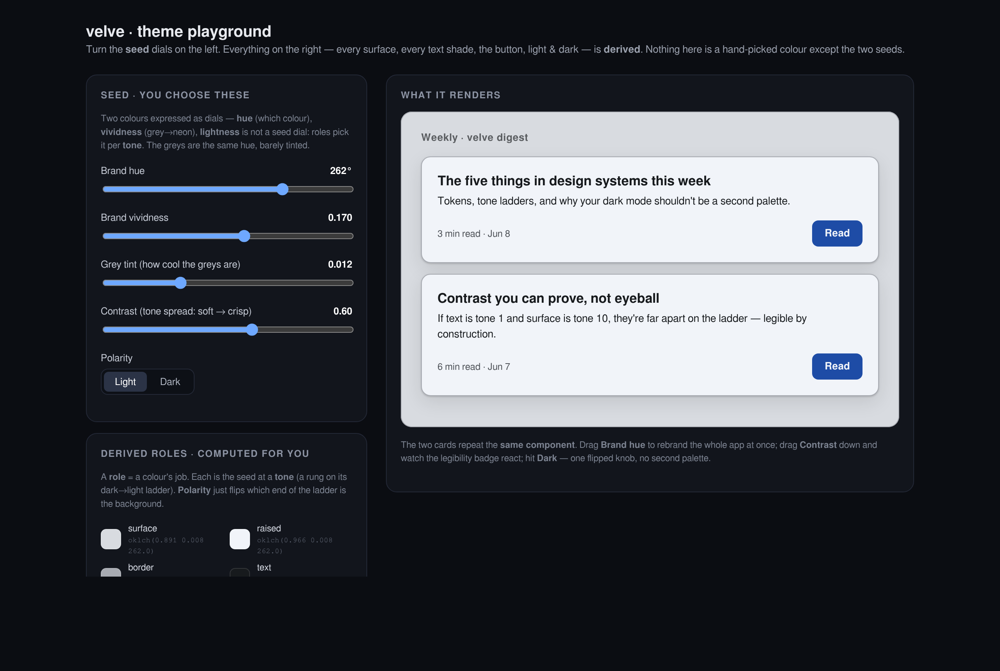

# Velve

A statically-typed language for building interactive applications, where the type
system carries the weight — from your data model all the way down to layout and
colour. If something can be wrong, Velve tries to make it a compile error rather
than a thing you discover in production.

> **Status: early and experimental (spec v0.5).** The grammar, type checker, and a
> tree-walking interpreter all work and run real programs, but the language is
> pre-1.0 and still moving. Expect sharp edges, and expect things to change.

```velve
type Email = String where matches(value, "^[^@ ]+@[^@ ]+\.[^@ ]+$")
type Age   = Number where 0 <= value && value <= 150

def greet(name: String, age: Age): String
  age < 18 ? "hi {name}" : "welcome, {name}"

def main(): Unit
  print(greet("Ada", 30))      -- ok
  -- greet("Ada", 200)         -- compile error: 200 fails refinement 'Age'
```

A refinement isn't a comment — it's checked. And the same discipline reaches further than
most languages take it: an unreadable colour is a type error, not a lint note.


## Getting started

You'll need Node.js and a C toolchain (for the tree-sitter parser).

```bash
cd checker
npm install
npm run build

node dist/index.js check refinement_test.velve   # type-check
node dist/index.js run   refinement_test.velve   # type-check and run
```

The runnable, passing programs are the `*_test.velve` fixtures in [`checker/`](checker/)
— each exercises one feature (refinements, pointers, units, the UI model, …), and each has
a `_bad` twin that's *supposed* to fail. The files under [`examples/`](examples/) are
broader, aspirational sketches of the *intended* full surface (an auth flow, a checkout
saga, a real-time dashboard); they're works in progress and don't all type-check yet.

## What makes it different

- **Inference that pulls its weight.** Hindley–Milner type inference means you
  rarely annotate; the compiler usually knows more than you wrote.
- **Refinement & dependent types.** `type Age = Number where 0 <= value` is checked at
  compile time for constants and guarded by `Age.parse` at runtime for the rest.
  Refinements can depend on other values (`InBounds(length xs)`).
- **An ownership model, type-driven.** Affine move-tracking, real pointers
  (`.&` / `.*`), region lifetimes with an outlives solver, and deterministic `drop`
  — copy types clone, resources move. It's the foundation a future GC-free compiled
  target will build on; today it runs on the interpreter.
- **Honest effects.** Every side effect is in the signature:
  `def save(): Effect [network, storage] ()`. A pure call to an effectful function is a
  type error.
- **Stateful logic as first-class shapes.** `store` (Elm-style state + messages),
  `machine` and `saga` (statecharts with persistence, compensation, and a replay
  journal), `stream` combinators with backpressure policies, and `transaction` blocks
  with rollback.
- **Security as structure.** `Tainted` values can't cross a trust boundary
  unchecked; injection prevention lives in the type system, not a linter.

## A type-checked UI — including the colours

Velve ships a declarative UI layer where the same type discipline reaches into styling.
Components are ordinary functions returning `Element`, and props are typed — so `gap=#ff0000`
or `radius=true` don't type-check, `width=Fill` / `width={Px 320}` are real units (a bare
number means pixels), and `gap` on a non-flex element is an error CSS would have silently
ignored.

The sharpest version of this is colour. Contrast is computed with the perceptual **APCA**
model and exposed as a refinement (`OnSurface = Color where contrast(value, surface) >= Lc`),
so text you can't read against its background *fails to compile*. The theme system builds on
that: you pick two seed colours and every surface, text shade, and light/dark variant is
**derived** — contrast holds by construction, and you can re-hue the whole app from one knob.



`uiModel(view())` renders the element tree to an annotated text outline — layout modes,
resolved props, contrast, accessibility flags — so a UI can be inspected and linted as plain
text:

```
Column  [flex]  gap=16 padding=24 background=#000000
  Text "Reports"  [leaf]  size=24 color=#ffffff
    · contrast 21.0:1 vs #000000 ✓
  Button  [leaf]
    ⚠ interactive element has no label/text (a11y)
```

## How it's built

Velve is three pieces:

| Piece | Where | What it does |
|---|---|---|
| **Grammar** | `grammar.js`, `src/` | A tree-sitter GLR grammar with an external scanner (`src/scanner.c`) for indentation. |
| **Checker** | `checker/src/` | Lowering (`lower.ts`), name resolution, HM inference + refinements (`infer.ts`), exhaustiveness (`exhaust.ts`), the borrow/ownership checker (`borrow.ts`), and a Z3 backend for proof obligations (`smt.ts`). |
| **Interpreter** | `checker/src/eval.ts` | A tree-walking evaluator with a deterministic scheduler, stores/sagas/machines, streams, transactions, and a runtime-backed standard library. |

There's also a live browser host: `node dist/index.js ast app.velve` ships the parsed program
as JSON and the interpreter runs it directly in the page (see `checker/web/`). The spec lives in
[`SPEC.md`](SPEC.md) — its §0.5 build-status table is the honest line between what's built and
what's intended — and deeper design notes are under [`docs/`](docs/).

## A small tour

```velve
-- Algebraic data types + exhaustive matching
type Status = Todo | InProgress | Done

def label(s: Status): String
  match s
    | Todo       -> "todo"
    | InProgress -> "in progress"
    | Done       -> "done"
-- a missing arm is a compile error

-- Pipes thread a value left to right; lambdas, currying, and partial application work
def evens(xs: List(Number)): List(Number)
  xs |> filter(fn x -> x % 2 == 0)

-- Stores: local state, messages in, computed values out
store Counter
  state
    n : Number = 0
  messages
    Inc -> { n: n + 1 }
  pub
    current = n
```

See [`SPEC.md`](SPEC.md) for the full surface: pattern matching, error propagation with `?`,
async/streams, effects and capabilities, the memory model, and transactions.

## Status & roadmap

Built today: the grammar (tree-sitter corpus tests), the type checker (inference, type
aliases, refinement and dependent types, exhaustiveness, the ownership/borrow checker, seven
proof obligations via Z3), the interpreter, and the UI layer above. In design or in progress:
a layout **convergence layer**, **responsive** values over a `Breakpoint` type, and a
**compiled, GC-free target** alongside the interpreter. These are sketches, not promises — the
language is young and the priorities shift.

## Tests & contributing

Run the parser corpus with `tree-sitter test` and the checker's fixtures with the `check` /
`run` commands above before sending a change. Because Velve moves quickly, it's worth opening
an issue to talk through larger ideas first.

## License

MIT.
